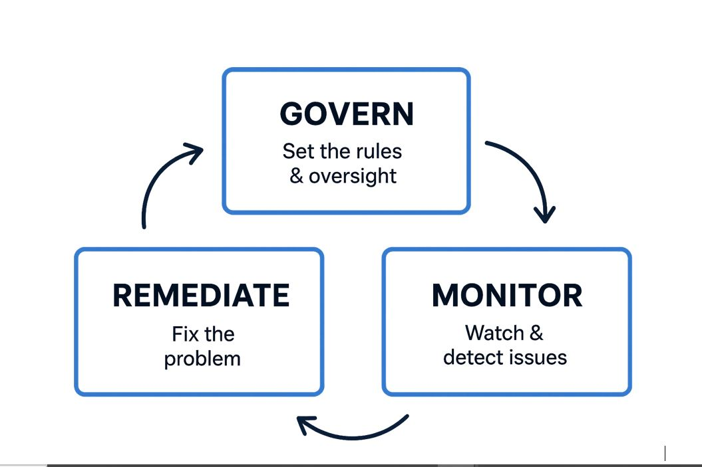

# Cybersecurity-Governance-Framework
Final Cybersecurity Governance &amp; Compliance Report: Risk Assessment, Policies, and Implementation Plan for a Simulated Nigerian Government Healthcare Agency.

# Final Cybersecurity Governance & Compliance Report  

**Title:** Enhancing Cybersecurity Posture and Regulatory Compliance:  
A Comprehensive Framework for a Nigerian Government Healthcare Agency  
**Date:** 07/09/2025  
**Target Environment:** Simulated Healthcare Infrastructure (Metasploitable 2)  
**Prepared for:** The Executive Board & Oversight Committee  
**Prepared by:** Nkemjika Omazi, Cybersecurity Governance Team  

---

## 📑 Table of Contents  
1. [Executive Summary](#1-executive-summary)  
2. [Introduction & Project Objectives](#2-introduction--project-objectives)  
3. [Risk Assessment Summary](#3-risk-assessment-summary)  
4. [Governance Framework Policies](#4-governance-framework-policies)  
5. [Implementation & Auditing Plan](#5-implementation--auditing-plan)  
6. [Actionable Recommendations & Roadmap](#6-actionable-recommendations--roadmap)  
7. [Conclusion](#7-conclusion)  

---

## 1. Executive Summary  
This report presents a complete cybersecurity governance and compliance strategy for a simulated Nigerian government healthcare agency.  
The initial risk assessment, conducted on a vulnerable Metasploitable 2 server, revealed a critical security posture with multiple high-risk vulnerabilities, including remote code execution flaws in key services (vsFTPd, Samba, Apache Tomcat) and weak authentication mechanisms.
The findings indicate a high risk of data breach, system compromise, and significant non-compliance with major regulatory frameworks including the Nigeria Data Protection Regulation (NDPR 2019), the General Data Protection Regulation (GDPR), ISO 27001:2022, and the NIST Cybersecurity Framework (CSF).

This report consolidates my response into a three-pillar approach: 

(1) Immediate technical remediation of critical vulnerabilities
(2) Establishment of robust governance policies for risk management, data security and auditing and 
(3) A detailed implementation and continuous monitoring plan. 
The provided roadmap is designed to systematically elevate the agency's security posture, protect sensitive patient data, and ensure ongoing regulatory compliance.

---

## 2. Introduction & Project Objectives  
The digital transformation of healthcare brings immense benefits but also significant risks, especially concerning sensitive patient data. This project simulates a real-world scenario to identify gaps and build a resilient cybersecurity governance structure.

## Primary Objectives:

**•	Identify & Assess:** Discover and evaluate cybersecurity vulnerabilities within the agency's simulated infrastructure.

**•	Govern & Comply:** Develop policies and strategies aligned with NDPR, GDPR, ISO 27001, and NIST CSF to address identified risks.

**•	Implement & Monitor:** Create a phased action plan for remediation, ongoing auditing, and continuous improvement to ensure sustained compliance and security.
 

---

## 3. Risk Assessment Summary  

  A thorough vulnerability assessment was performed, revealing a severely compromised initial state.
  
**Key Findings:**

**•	Critical Vulnerabilities:** Multiple services were configured with critical flaws allowing unauthorized access and full system control.

- **vsFTPd 2.3.4 Backdoor (CVE-2011-2523):** Critical (CVSS 9.8) - Allows remote attackers to execute arbitrary code.
 
- **Samba usermap script Remote Command Execution (RCE (CVE-2007-2447)):** Critical (CVSS 10.0) - Allows remote command execution.
 
- **Apache Tomcat 5.5:** Critical - Multiple legacy exploits leading to information disclosure and RCE(Remote Code Execution).
 
- **MySQL Auth Bypass (CVE-2012-2122):** High - Could allow attackers to bypass authentication.
 
**•	Poor Security Practices:** Anonymous FTP logins, unencrypted Telnet services, and weak encryption (SSLv2) were prevalent, violating core principles of confidentiality and integrity.

**•	Compliance Gaps:** The state of the systems directly violates multiple articles and controls of NDPR, GDPR, ISO 27001, and NIST CSF, particularly concerning patch management, access control, and data protection.

**Top Risk Summary Table:**

| Vulnerability | CVE ID | CVSS Score | Risk Level | Compliance Impact |
|--------------|--------|-----------|-----------|-----------------|
| vsFTPd 2.3.4 Backdoor | CVE-2011-2523 | 9.8 (Critical) | **Critical** | NDPR 2.6, GDPR Art. 32, ISO A.8.8 |
| Samba RCE | CVE-2007-2447 | 10.0 (Critical) | **Critical** | NDPR 2.6, GDPR Art. 32, ISO A.8.8 |
| Anonymous FTP Login | N/A | 7.5 (High) | **Critical** | NDPR 2.6, GDPR Art. 25/32 |
| Apache HTTPD Vulns | Multiple | 7.5 (High) | **Critical** | NDPR 2.6, ISO A.8.8 |
| Tomcat 5.5 RCE | Multiple | 9.0 (Critical) | **Critical** | NDPR 2.6, ISO A.8.8 |

**Poor Security Practices Identified:**  
- Anonymous FTP access  
- Unencrypted Telnet  
- Outdated software (Apache, MySQL)  
- Weak encryption (SSLv2)  

---

## 4. Governance Framework Policies  

### 4.1 Risk Management Policy  
- **Purpose:** Provide a structured framework for identifying and treating risks.  
- **Key Provisions:**  
  - Regular vulnerability scans  
  - Risk register with Likelihood/Impact matrix  
  - SLA-based remediation timelines (Critical: 1 week, High: 2 weeks)  
- **Compliance Mapping:** NIST CSF ID.RA-01–04, ISO 27001 A.8.8, GDPR Art. 32  

### 4.2 Data Security Policy  
- **Purpose:** Protect confidentiality, integrity, and availability of patient data.  
- **Key Provisions:**  
  - AES-256 encryption at rest, TLS 1.2+ in transit  
  - RBAC enforcement  
  - Secure data disposal procedures  
  - Breach notification within 72 hours  
- **Compliance Mapping:** NDPR Sec. 2.1 & 4.2, GDPR Art. 5, 25, 32, 33, 34  

### 4.3 Auditing & Compliance Policy  
- **Purpose:** Ensure accountability and ongoing compliance.  
- **Key Provisions:**  
  - Quarterly internal audits  
  - Annual ISO 27001/GDPR compliance checks  
  - Management review of results  
- **Compliance Mapping:** GDPR Art. 5(2), ISO 27001 A.18.2.3  

---

## 5. Implementation & Auditing Plan  

A phased approach is designed for effective execution with minimal disruption.

**Phase 1:** Immediate Remediation (Weeks 1–2)  

**•	Actions:** Disable anonymous FTP and Telnet(use only for testing or validatiion). 

Apply available patches for vsFTPd, Samba, Apache, and MySQL. 

Isolate critical databases.

**•	Owner:** IT Security Team & System Administrators.

**Phase 2:** Control Implementation (Weeks 3–4)  

**•	Actions:** Enforce password policies and Role Based Access Control(RBAC).

 Configure TLS for SMTP and web services. 
 
 Deploy a centralized logging solution (e.g., Splunk/Syslog).
  
**•	Owner:** System Administrators & Compliance Officer.

**Phase 3:** Monitoring & Auditing (Ongoing)  

**•	Actions:** Implement weekly vulnerability scans. 

  Schedule monthly compliance audits against control frameworks. 
  
  Conduct quarterly penetration tests.

**•	Owner:** IT Security Team & Compliance Officer.

**Monitoring KPIs:**  

•	% of Critical Vulnerabilities Patched within SLA

•	% of Systems with Encryption Enforced

•	Number of Audit Findings per Cycle
 

---

## 6. Actionable Recommendations & Roadmap  

| Priority | Recommendation | Framework Mapping | Timeline |
|---------|----------------|------------------|---------|
| **Critical** | Establish formal patch mgmt program | ISO 27001 A.8.8, NIST PR.IP | Immediate |
| **Critical** | Disable insecure services (FTP, Telnet) | GDPR Art. 32, NIST PR.AC-5 | Immediate |
| **High** | Implement network segmentation | ISO 27001 A.8.22 | 1–2 Weeks |
| **High** | Deploy IDS (Snort) + SIEM (Splunk) | NIST DE.CM-1, ISO A.8.16 | 2–4 Weeks |
| **Medium** | Security awareness training | ISO A.6.3, NIST PR.AT-1 | Ongoing |
| **Strategic** | Achieve ISO 27001 certification | ISO 27001, GDPR Art. 32 | 6–12 Months |

---

## 7. Conclusion  

The simulated environment exposed critical risks that are unfortunately common in real-world scenarios. This report provides a clear and actionable path going forward. By diligently executing the outlined implementation plan and adhering to the proposed governance policies, the Nigerian Government Healthcare Agency can significantly reduce its attack surface, protect the sensitive health data of its citizens, and achieve demonstrable compliance with stringent national and international regulations. Continuous vigilance, executive oversight, and a culture of security are paramount for long-term success.

---

🔗 **LinkedIn:** [Connect with me here](https://www.linkedin.com/in/nkemjika-omazi/)
📧 **Contact:** nkem.the.maths.tutor@gmail.com  
